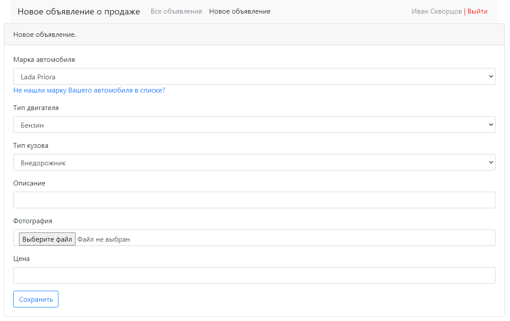
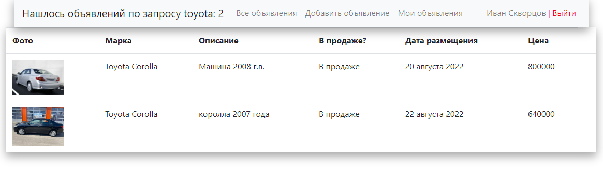

<a name="title"><h2>Приложение Cars</h2></a>

Web-приложение для продажи машин.

<a name="tech"><h2>Стек используемых технологий</h2></a>

<a name="tech"><h2>Скриншоты приложения</h2></a>

Страница авторизации пользователя в приложении:

Страница регистрации нового аккаунта в приложении:

Страница со всеми объявлениями:

Таблица с объявлениями сортируема по колонкам (по умолчанию - сортировка по дате, затем по цене). 
Каждое объявление кликабельно.
Объявления могут быть с фото или без.
В приложении есть фильтры объявлений только с фотографиями и только за прошедшие сутки,
также есть поиск по марке автомобиля.

Страница отдельного объявления:

Возможность продать автомобиль (нажать кнопку "продано") имеется только у аккаунта-создателя этого объявления.
В этом случае статус автомобиля меняется на "Машина продана".
Также только у создателя есть возможность отредактировать или удалить объявление.
При наведении на фото курсора - фото увеличивается:

Страница редактирования объявления:

Страница добавления нового объявления:

Если марки автомобиля нет в выпадающем списке - при переходе по ссылке открывается новое окно,
где можно добавить свою марку, тип кузова и двигателя:

Страница с объявлениями только пользователя текущей сессии:

Страница, на которой собраны только объявления с фото:

Страница с объявлениями за прошедшие сутки:

Страница с поиском объявлений:

Поиск case-insensitive, искать можно по марке/модели 
(к примеру "toyota" и "corolla" выдадут одинаковый список объявлений)
Если в запросе указана марка, которой нет в объявлениях - вернется страница с таким сообщением:

